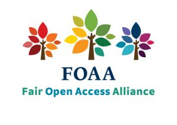
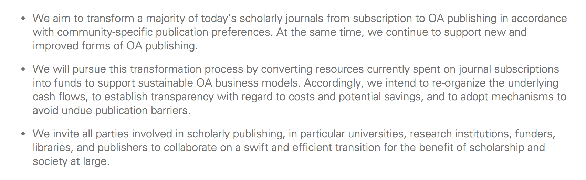

<!-- 30 min including questions -->
<!--https://stackoverflow.com/questions/23082660/how-to-style-images-in-reveal-js -->

## Fair Open Access 

<small>fairopenaccess.org</small>

<small>Alex Holcombe</small> <small>(Professor, the University of Sydney)</small>

<small>Chair, PsyOA.org</small>

<aside class="notes">
	's' to open speaker presentation with notes view
	'f' enable fullscreen mode
	'o' enable overview mode
</aside>

## Journals are (approximately) communities of scholars

> - But often owned or run by a publisher
> - The interests of publishers typically do not align well with that of scholars or the public

<aside class="notes">
  Typicaly they were created by scholars in order to get their work out to be read and used by the world.
  But many publishers have ended up with a business model based on restricting access.
</aside>

## Scholarly articles

- Copyright signed over to publishers who then charge us to read.

- Open-access journals have made major headway, but still far to go.
    - Do not fully address the misalignment problem.
    - Universities are still paying more each year for journal content.

## OA2020

## APC

- In science, many open access journals are funded by APCs - Article Processing Charges.

- Paid for by grant funder, university, or even out-of-pocket.

<aside class="notes">
	some unfortunate aspects to this
</aside>

## Unfortunate aspects of APCs

- Disadvantage poor authors (although many journals have waivers for developing countries)

- Prices can be high; not saving academia much money 

    - Scientific Reports ($1,760) versus Nature Communications ($5,200)

<aside class="notes">
Greater appreciation of this recently esp. in the UK
We're not necessarily opposed to other approaches like OA2020.
</aside>

## FairOA - Fair Open Access principles

Formulated by a group of researchers and university librarians.

- Open access

- No fees

- Governance transparent and by the scholarly community

<aside class="notes">
Fair in that you don't 
Fair means the journal is run by the people who are most responsible for it.
</aside>

## The FairOA Principles - fairopenaccess.org

- The journal has a transparent ownership structure, and is controlled by and responsive to the scholarly community.

- Authors of articles in the journal retain copyright.

- All articles are published open access and an explicit open access licence is used.

- Submission and publication is not conditional in any way on the payment of a fee from the author or its employing institution, or on membership of an institution or society.

- Any fees paid on behalf of the journal to publishers are low, transparent, and in proportion to the work carried out.

## the FairOA Foundations

- promote and support initiatives concerning (Fair) Open Access publications in the broadest sense
- acquire resources and financially sustain (Fair) Open Access publications;
- support foundations financially and otherwise in various disciplines (xxxOA’s) that pursue the same goals
- expand the Open Library of Humanities to other disciplines.
- propagate and promote the principles of Fair Open Access over all disciplines of science.

<aside class="notes">
Small grant from OPenAIRE
</aside>

## PsyOA {data-background-iframe="http://psyoa.org/transitioning/"}
##

## LingOA

A leading subscription linguisics journal left their owner (Elsevier). New journal *Glossa* created, pubished by
Open Library of the Humanities *under a contract*.

## Journals that flipped recently

> - Algebraic Combinatorics (Mersenne)
> - Journal of Cognition (Ubiquity) (seeking funding)

## Specific assistance the FairOAs provide

- List, comparison of low-cost publishers
- Access to legal advice
- Feedback on strategy

<aside class="notes">
Editorial community building advice.
</aside>

