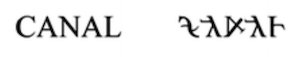
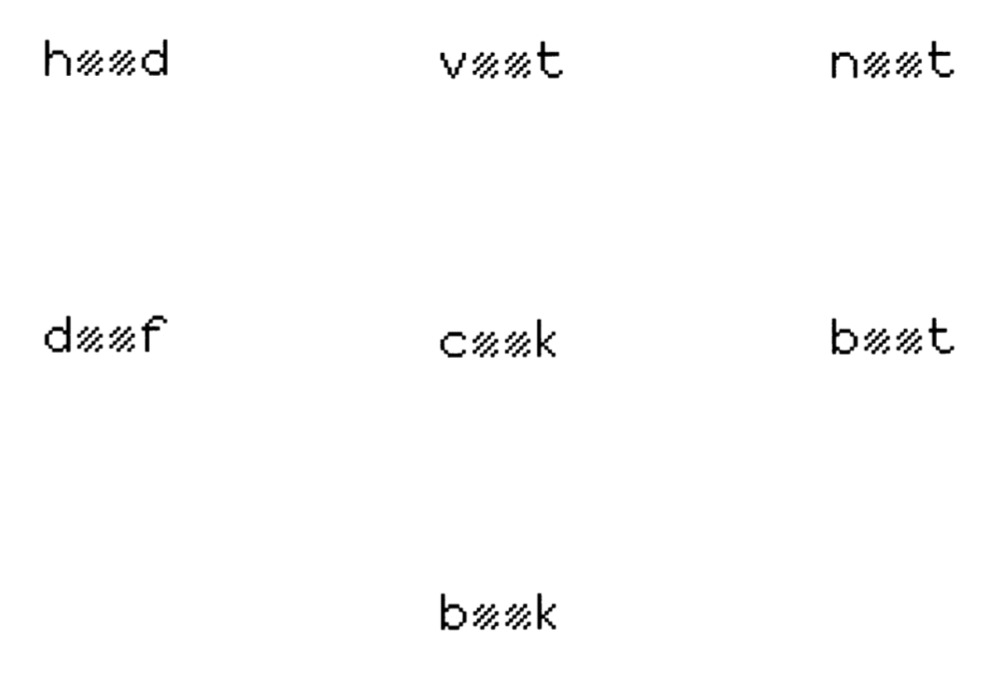

## Letter height

## Auditory filling-in words 

The picket-fence effect with speech
http://webpages.mcgill.ca/staff/Group2/abregm1/web/downloadstoc.htm

<section data-notes="Something notey"></section>

## Visual filling-in words

## Visual filling-in words

## Visual filling-in words

## The illusory-letters phenomenon

Jordan, T. R., Thomas, S. M., & Scott-Brown, K. C. (1999). The illusory-letters phenomenon: an illustration of graphemic restoration in visual word recognition. Perception, 28(11), 1413–1416.

